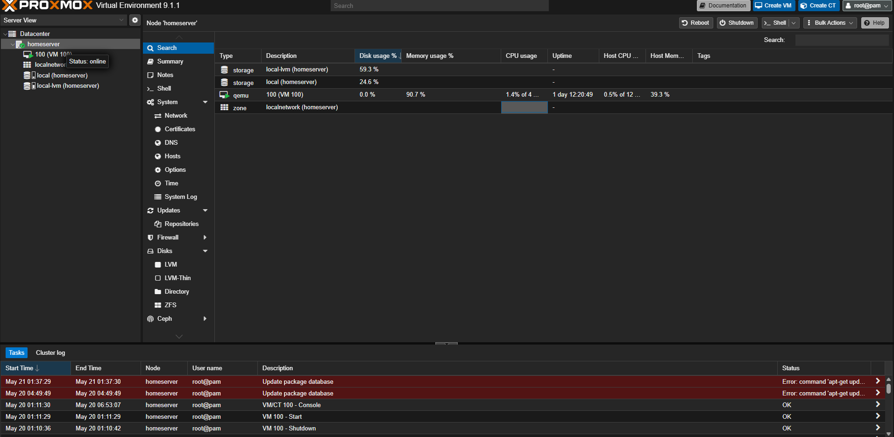
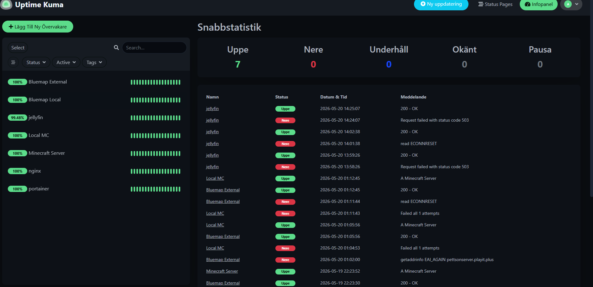
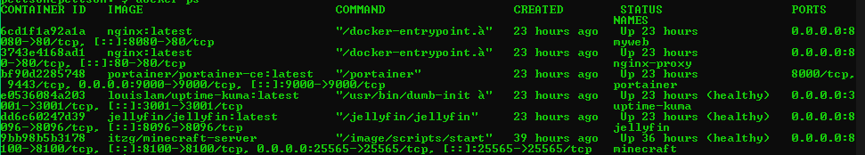
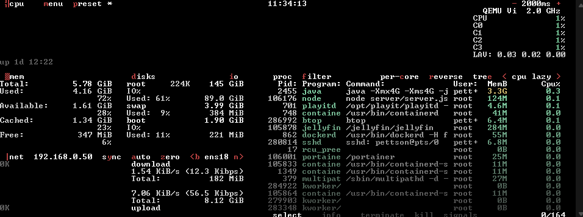
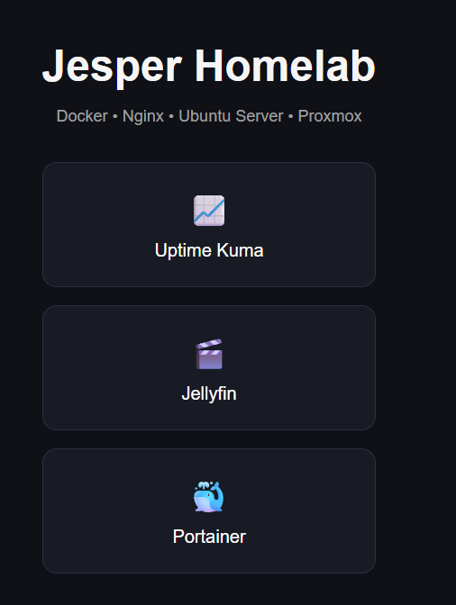
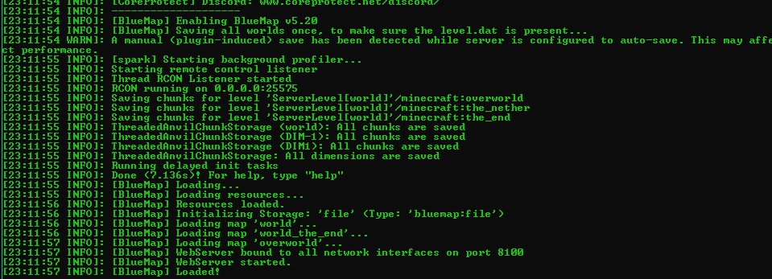

# Homelab Infrastructure

A self-hosted homelab environment focused on learning Linux system administration, Docker, networking, monitoring, and infrastructure management.

## Overview

This project documents my ongoing homelab setup running on Proxmox with Ubuntu Server virtual machines and containerized services.

The goal of the project is to gain hands-on experience with:

* Linux administration
* Docker and Docker Compose
* Reverse proxies
* Monitoring and uptime tracking
* Backup automation
* Networking and DNS
* Infrastructure troubleshooting

---

## Technologies Used

* Proxmox VE
* Ubuntu Server
* Docker
* Docker Compose
* Nginx
* Uptime Kuma
* Jellyfin
* Paper Minecraft Server
* Playit.gg
* Bash scripting
* Cron jobs

---

## Services Running

### Jellyfin

Self-hosted media streaming server.

### Uptime Kuma

Monitoring and uptime tracking for internal and external services.

### Nginx Reverse Proxy

Used to route traffic to self-hosted services.

### Minecraft Server

PaperMC server hosted in Docker with automated backups and monitoring.

### Portainer

Container management interface for Docker services.

---

## Features

* Dockerized services
* Automated Minecraft backups using cron
* Monitoring with Uptime Kuma
* Resource monitoring with btop and docker stats
* Reverse proxy setup using Nginx
* Automatic container restart policies
* Storage troubleshooting and monitoring
* SSH-based server administration

---

## Challenges and Troubleshooting

Some issues encountered during the project:

* VM instability caused by low available RAM
* Disk pressure during large file transfers
* Reverse proxy configuration issues
* Jellyfin transcoding causing high resource usage
* Service recovery after crashes

### Solutions Implemented

* Reduced Minecraft memory allocation
* Added monitoring tools for RAM and disk usage
* Implemented automated backup scripts
* Improved Docker organization and restart policies
* Expanded VM storage and optimized resource usage

---

## Future Goals

* Add domain-based access to services
* Improve backup strategy
* Add more automation scripts
* Learn Kubernetes and advanced container orchestration
* Expand monitoring and alerting

---

## Screenshots

### Proxmox Virtualization Environment

### Uptime Kuma Monitoring Dashboard

### Docker Containers

### Resource Monitoring with btop

### Homelab Homepage / Reverse Proxy

### Minecraft Server Logs

---

## What I Learned

This project helped me gain practical experience with Linux servers, Docker, networking, monitoring, troubleshooting, and infrastructure management in a real hands-on environment.
